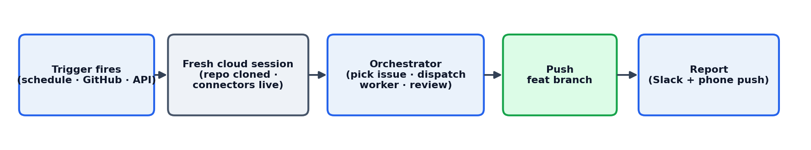
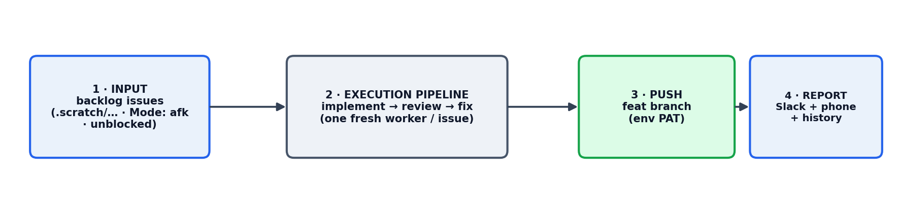
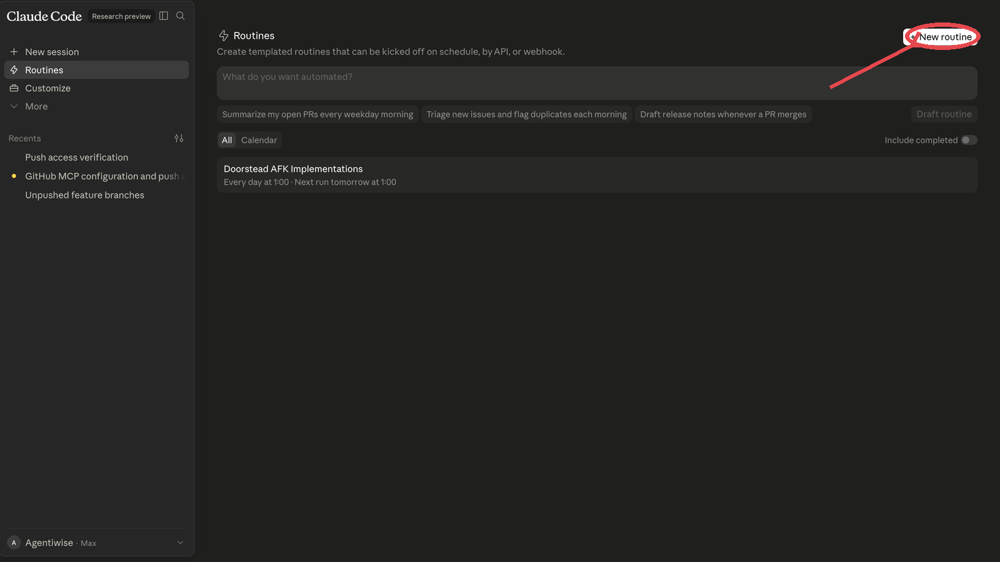
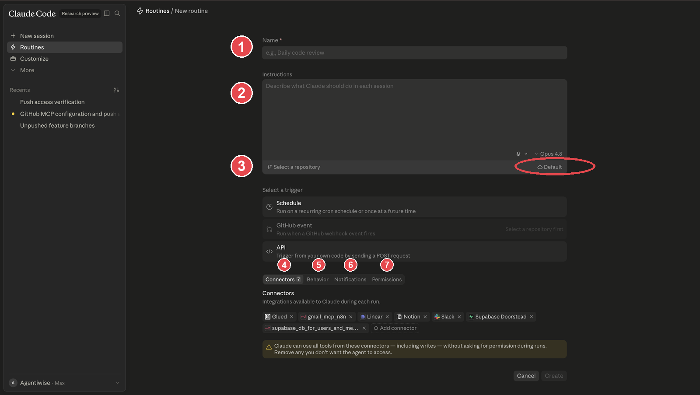
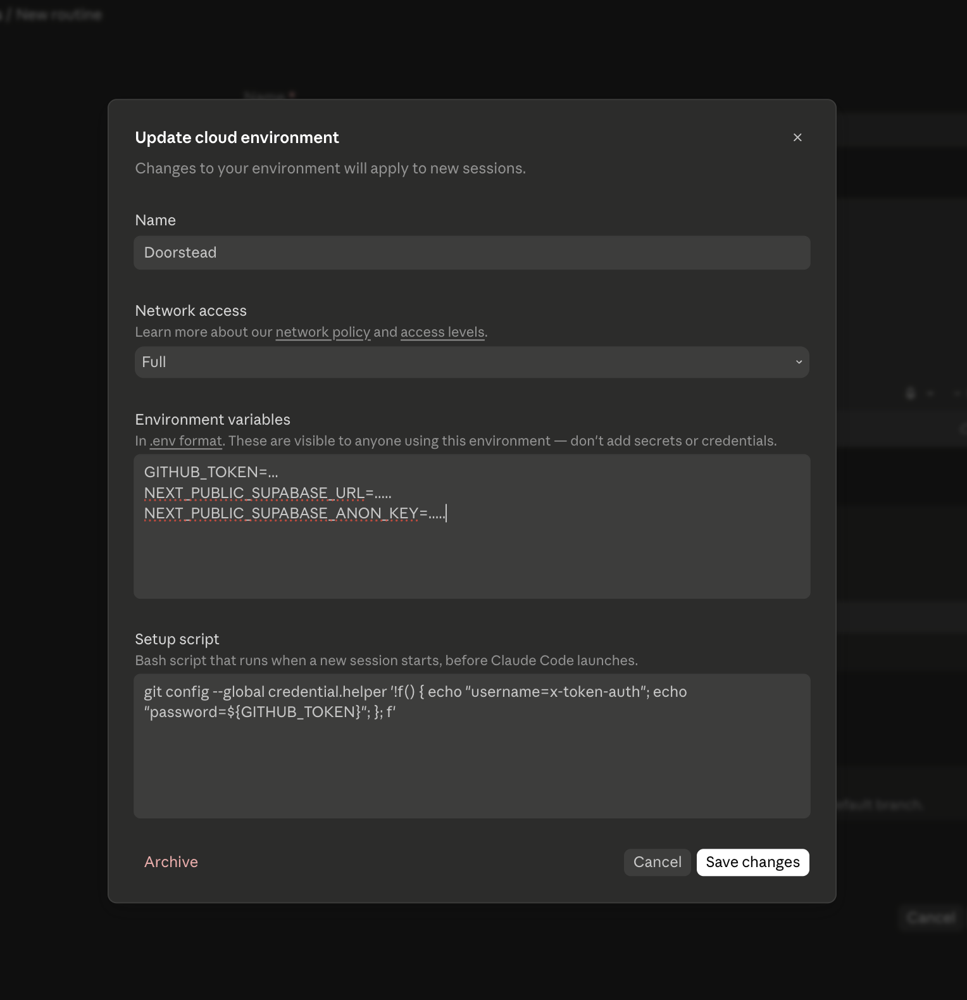
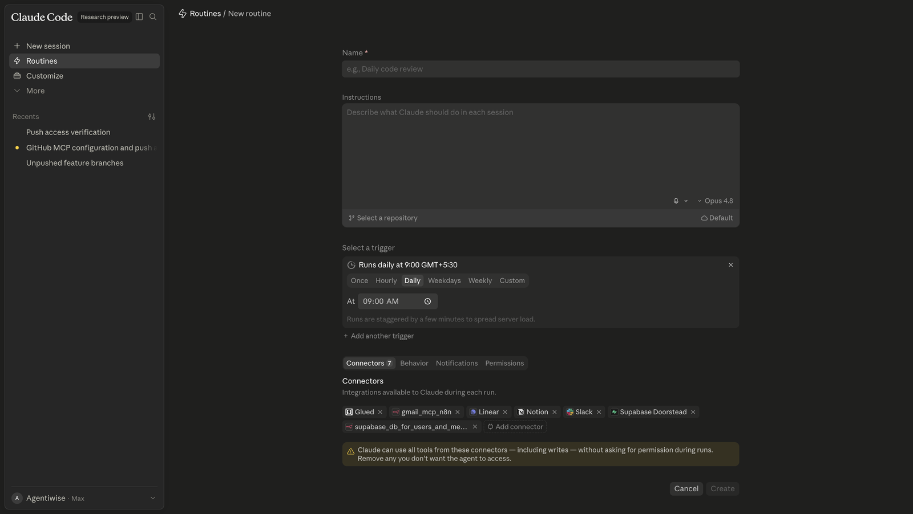
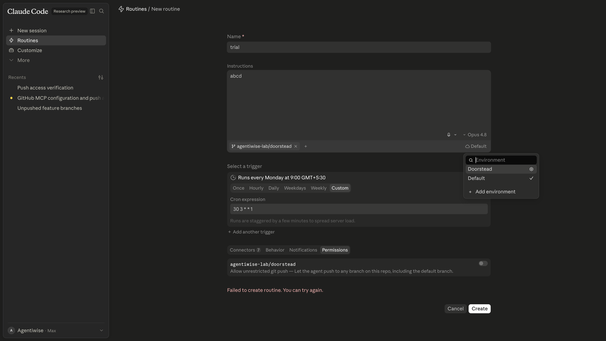

# Relay CRM — Stage 10 (Routines): true AFK with Claude Cloud Routines

Relay is a tiny CRM. Across this class we add a **Lead Scoring** feature to it one
stage at a time. Stage 10 is the **AFK** ("away from keyboard") step: let an agent work
the backlog unattended.

There are two ways to run AFK, and this branch teaches the second one:

- **`10_begin` / `10_end`** — the **self-hosted** way: a Ralph loop (`scripts/run-once.sh`,
  `scripts/afk-loop.sh`) you run yourself, inside a Docker sandbox, on a machine that stays
  on. You own the container, the scheduler, the credentials, and the uptime.
- **`10_begin_claude_afk` (this branch)** — the **hosted** way: **Claude Cloud Routines**. The cloud
  provides the sandbox, the scheduler, the connectors, per-run isolation, run history, and
  phone notifications. You bring one thing: a well-harnessed prompt.

> Sibling teaching branch — it does not replace the lead-scoring build. Keep
> `10_begin`/`10_end` for the self-hosted demo, use `10_begin_claude_afk` for the hosted one.

---

## 1. What a Routine is

- A **Routine** is a saved, templated Claude Code session that fires on a trigger.
- Each fire is a **cold, fresh cloud session**: it clones the repo, reads its instructions,
  runs, and reports.
- Nothing carries between fires except what you wrote to the repo. **Cold-every-time** is
  what makes an AFK loop safe and idempotent.
- Inside a fire it runs an **orchestrator + workers**:
  - the **orchestrator** (your prompt) never writes code — it triages the backlog,
    dispatches **one fresh worker per issue**, reviews the result, and reports;
  - each **worker** is a fresh context that resolves exactly one issue with `/build` (or
    `/diagnose`), then hands back a status.

**Anatomy of one fire:**



The Relay orchestrator prompt is in
[`docs/routines/relay-afk-orchestrator.md`](docs/routines/relay-afk-orchestrator.md).

---

## 2. The four steps of an AFK loop

Zoom out from the UI: every unattended loop — hosted or self-built — runs in four steps.
Get all four right and it runs itself; miss one and it stalls or goes rogue.



1. **Input** — a machine-readable backlog the loop can select from without a human:
   `.scratch/lead-scoring/*.md`, gated by `Mode: afk`, `Status:`, `## Blocked by`. Vague or
   unbounded input is what breaks autonomous loops first.
2. **Execution pipeline** — *implement → review → fix*, one fresh worker per issue, with a
   **bounded** fix loop (one pass, then escalate — never grind).
3. **Push** — land the work on a `relay/<slug>` branch (never the default branch); from a
   routine this needs the PAT (see **Git push from a routine**).
4. **Report** — tell a human what happened and surface anything deferred (Slack + phone +
   the platform's run history).

---

## 3. Connectors — the pillars of the routine

Connectors are the tools the run may call, and they run with **write access and no per-call
prompt**. Attach the ones this repo's routine needs:

- **The repository** — the core pillar. The run edits code and pushes a branch. (Git push
  from a routine needs the PAT setup — see **Git push from a routine**.)
- **Slack** — to post the end-of-run report and messages to a channel.
- **The repo's database connector (e.g. Supabase)** — if the repo uses a database, attach
  its connector. You need it when you want the AFK loop to make **data or schema changes**,
  not just code changes.

> ⚠️ A database connector runs with write access and no prompt, so the unattended loop can
> change your data or schema. Scope it to a non-prod project and attach it only when the
> routine's job genuinely needs it.

---

## 4. The components of true AFK

Six things must be decided before a routine is safe to run unattended:

1. **Trigger** — when it fires: a cron schedule, a GitHub event, or an API call. For a night
   shift, a recurring cron (e.g. `30 3 * * 1` = 03:30 Monday).
2. **Issue source** — where work comes from: **the repo itself**, the local-markdown tracker
   `.scratch/lead-scoring/NNN-*.md`, gated by `Mode: afk`, `Status:`, and `## Blocked by`.
   (Same selection `scripts/run-once.sh` makes — no external tracker.)
3. **Human-in-the-loop gate** — decided in **both** places: `CLAUDE.md` holds the repo-wide
   "never do X" rules, and the **orchestrator prompt** says where to stop and when to hand
   off. Anything `Mode: human-in-loop`, or touching a risky/irreversible surface (schema,
   auth, data deletion), or where the right behaviour is a product call → the orchestrator
   defers it (`Status: needs-human`, notes why) and never guesses.
4. **Permissions / guardrails** — which connectors are attached (see **Connectors**), what
   the Permissions tab withholds, and the git-push PAT (see **Git push from a routine**).
5. **Notifications** — a phone push (and a Slack post) when it finishes or needs you (see
   **Notifications**).
6. **Monitoring** — the platform keeps the run history and logs for you; nothing to build.

---

## 5. Create a Routine

### Step 1 — open Routines and start one
Go to **[Routines](https://claude.ai/code/routines)** and click **New routine** (circled).



### Step 2 — fill the form
The numbered callouts, in the order you fill them:



1. **Name** the routine.
2. **Instructions** — paste the orchestrator prompt
   ([`relay-afk-orchestrator.md`](docs/routines/relay-afk-orchestrator.md)).
3. **Repository & environment** — pick the repo the run works in, and the cloud environment
   it boots into (the ringed **Default** picker). Open the environment to set network
   access, environment variables (incl. the git-push PAT — see **Git push from a routine**),
   and the setup script:

   

4. **Connectors** — attach only what the job needs (see **Connectors — the pillars of the
   routine**).
5. **Trigger** — Schedule / GitHub event / API. For a night shift, a cron:

   

6. **Behavior** and **Permissions** tabs — behaviour settings, and grant/withhold risky
   abilities. Note: the **"allow unrestricted git push"** permission **currently errors** —
   leave it, and give the run push access through the PAT (see **Git push from a routine**)
   instead.

   

### Step 3 — create it
Hit **Create**. It now fires on the trigger you chose.

---

## 6. Git push from a routine — the PAT setup

Inside a Claude routine, **enabling git push currently errors** — the run can commit locally
but the push is blocked, and the "allow unrestricted git push" toggle (the Permissions step
in **Create a Routine**) doesn't work yet. The working bypass:

1. Create a GitHub **PAT** (fine-grained, scoped to the target repo, **read + write** on
   contents) so the routine can push branches.
2. Add it to the routine's **environment variables** (e.g. `GITHUB_TOKEN`).
3. In the environment's **setup script**, wire it into git's credential helper so pushes
   authenticate automatically, e.g.:
   ```bash
   git config --global credential.helper \
     '!f() { echo "username=x-access-token"; echo "password=${GITHUB_TOKEN}"; }; f'
   ```
4. The orchestrator prompt then pushes `relay/<slug>` normally — the credentials come from
   the environment, so the run never handles the token inline.

> The PAT lives in the environment, not the prompt or the repo. Scope it to the one repo and
> to the branches the routine needs.

---

## 7. Harnessing the loop: `CLAUDE.md` + the prompt

Guardrails come from **both** homes and they compose. The test: *would a human running
`/build` interactively also have to obey it?* If yes → `CLAUDE.md`. If it's only about how
this unattended run behaves → the prompt.

**In `CLAUDE.md` (repo-wide invariants, pushed to `/review`) — be concrete, not "be careful":**

- **No destructive git history** — never force-push, rewrite published commits, or drop
  commits.
- **No destructive DB changes** — never drop, truncate, or rewrite data or schema in a way
  that loses information.
- **Retry caps live on the unit of work, not the row** — cap external-call retries per
  comment/email/order, and respect the upstream's do-not-retry signal.
- **Test behaviour through the `LeadRepo` seam, use fakes not mocks** — a test reads like a
  line from the spec and survives a refactor.
- **Out-of-scope is the definition of done** — anything QA turns up becomes a *new* issue,
  never silent scope creep.
- **Never commit to the default branch** — every change on `relay/<slug>`.

**In the orchestrator prompt (this run's policy) — concrete stop conditions, not vibes:**

- **Hard defer gate:** stop and mark `needs-human` for any issue that touches a schema/data
  migration, auth, payments, a public API contract, or deletes data — never guess the call.
- **Bounded fix loop:** one fix-worker pass per issue, then escalate — never spawn a second.
- **One fresh worker per issue;** two issues sharing a `relay/<slug>` branch are serialized.
- **Review at the orchestrator level, never inside a worker.**
- **Compact after each resolved-and-marked issue (or each parallel batch)** so the
  orchestrator stays in the smart zone across a long backlog.

---

## 8. Notifications

- The orchestrator ends with a **PushNotification**. Allow the Claude Code **notification
  permission** on your phone so a run that needs a human reaches you.
- If Slack is attached, the end-of-run summary is posted to the channel.
- Everything else (per-fire history, logs) is in the Routines UI — no custom logging needed.

---

## 9. Adapt it to your repo

The orchestrator prompt is Relay-specific in three places:

1. **Issue source** — swap the `.scratch/<feature>/` scan for your tracker; the gate logic
   (ready = actionable + unblocked + not-done) is the same.
2. **Connectors** — attach the pillars *your* job needs (see **Connectors**): repo + Slack
   for a coding loop; add the repo's database connector when you want the loop to change
   data or schema.
3. **Skills + push target** — Relay uses `/triage`, `/build`, `/diagnose`, `/review`; point
   the Slack channel and the PAT/remote at your project.

Everything else — orchestrator-never-codes, one-fresh-worker-per-issue, review-at-the-top,
defer-don't-guess, compact-between-issues, cold-and-idempotent — is the portable pattern.
